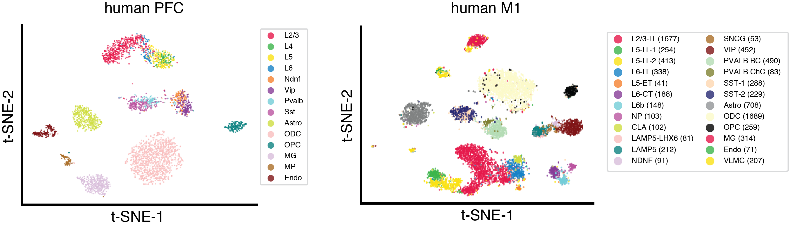
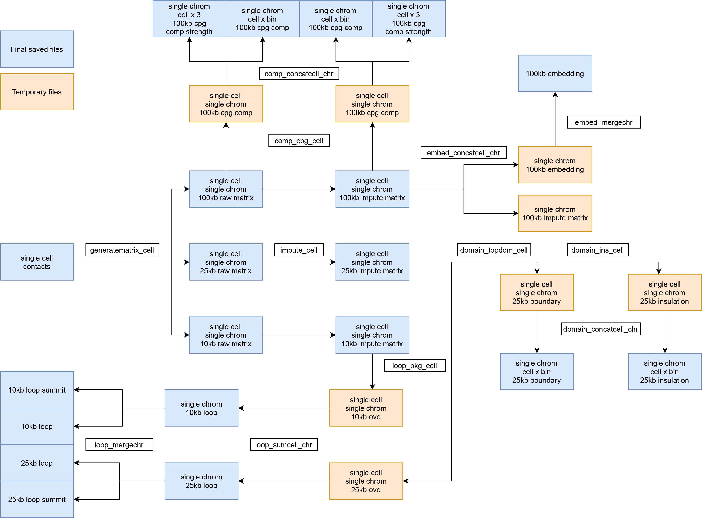

# scHiCluster
## Introduction
scHiCluster is a comprehensive python package for single-cell chromosome contact data analysis. It includes the identification of cell types (clusters), loop calling in cell types, and domain and compartment calling in single cells.

  

## Installation
Running scHiCluster requries numpy, scipy, pandas, h5py, scikit-learn, opencv-python, statsmodels.  
In order to visualize the results, we also need matplotlib, umap-learn, multicore-tsne, and harmonypy to account for potential batch effects.  
First, creat a new conda environment and activate it by
```
conda create -n schicluster python==3.6.8
conda activate schicluster
```
Then install install scHiCluster by
```
pip install schicluster
```

## Tutorial
[snm3C-seq of human prefrontal cortex](https://github.com/zhoujt1994/scHiCluster/tree/master/example/humanPFC)  
[sci-HiC of 4DN cell lines](https://github.com/zhoujt1994/scHiCluster/tree/master/example/4DN)

## Function
  

## Usage
### General file
HiCluster requires a the chromosome size file in several following steps, where the first column is the chromosome name and the second column is the size of the chromosome in bps. The files for hg38, hg19, and mm10 are provided in file/ folder of this repo.

### Clustering
HiCluster uses linear convolution and random walk with restart to impute the chromatin contact matrices for each cell and each chromosome separately. The imputed matrices are then concatenated and used for embedding, visualization and clustering.

The input file format for scHiCluster is the sparse format contact matrices. For each cell and each chromosome, the input file should contain three columns separated by tab, representing the interacting bins and the number of reads supporting the interaction. The name of the file need to be in the format of '{cell_id}_{chromosome}.txt'.  

As an example, at 1mb resolution, if there are 10 reads in cell_1 supporting the interaction between chr1:1000000-2000000 and chr1:5000000-6000000, this should be represented as
> 1	5	10

in a single line of the file named as cell_1_chr1.txt. 

Alternatively, if you have the chromatin contact file of a single cell, the following command can be used to generate the input matrices at a specific resolution. The contact file should have the chromosome names and positions of the two interaction anchors of each contact in a single line. The option --chr1 --pos1 --chr2 --pos2 are used to indicate which columns of the file contain these information. Note that the columns should be counted start from 0. As an example, if using the [juicer-pre short format](https://github.com/aidenlab/juicer/wiki/Pre#short-format), the conmmand should be
```bash
hicluster generatematrix-cell --infile ${contact_file} --outdir ${raw_dir}/ --chrom_file ${chromosome_size_file} --res ${resolution} --cell ${cell_id} --chr1 1 --pos1 2 --chr2 5 --pos2 6
```
Then you can impute a single-cell contact matrix by
```bash
hicluster impute-cell --indir ${raw_dir}/${chromosome}/ --outdir ${impute_dir}/${chromosome}/ --cell ${cell_id} --chrom ${chromosome} --res ${resolution} --chrom_file ${chromosome_size_file}
```
This can be easily parrelized across cells and chromosomes with your own server system.

After imputation, the following command can be used to concatenate all single-cell imputed matrices. You need to provide a list of imputed files need to be concatenated. Remember to ensure the lists for all chromosomes have the same order of cells.
```bash
# concatenate cells for each chromosome
ls ${impute_dir}/${chromosome}/*${imputation_mode}_${chromosome}.hdf5 > ${impute_file_list}
hicluster embed-concatcell-chr --cell_list ${impute_file_list} --outprefix ${embed_dir}/${imputation_mode}_${chromosome} --res ${resolution}

# merge chromosomes
ls ${embed_dir}/${imputation_mode}_*npy > ${embed_file_list}
hicluster embed-mergechr --embed_list ${embed_file_list} --outprefix ${embed_dir}/${imputation_mode}
```
where the imputation_mode is a name that can be defined by the user in the impute-cell command, and default to be 'pad?_std?_rp?_sqrtvc' based on the imputation parameters.

The embedding generated here could be further used for batch-effect correction, clustering, and visulization (See [tutorials](#tutorial) for details).

### Loop calling

The loop calling framework is modified from SnapHiC. When using these functions, please cite [Yu, Abnousi et al. 2020](https://www.biorxiv.org/content/10.1101/2020.12.13.422543v1). The algorithm uses single-cell imputed matrices as input. It first normalize the matrices by distance decay, and next compute the difference between each element in the normalized matrix and its local background to allow for a paired t-test across cells in the next step. Finally the single-cell level matrices of the same cell type are merged, and the paired t-test and other ad-hoc filters are applied to identify loops.  

First, use the imputed matrix (Q) of each single cell to compute the distance normalized matrix (E) and its differences with local background (T).
```bash
hicluster loop-bkg-cell --indir ${impute_dir}/ --cell ${cell_id} --chrom ${chromosome} --res ${resolution} --impute_mode ${imputation_mode}
```
Next for each chromosome, merge a group of cells to generate the pseudobulk level impute matrix (Q), normalized matrix (E), outlier proportion matrix (O). Then it performs the paired t-test across cells and compute fold changes against different types of local backgrounds to generate summary statistics for loop candidates.  
Note that the function has a defaufting naming system of files, which is consistent with the output of the previous step (.hdf5 for Q, .E.hdf5 for E, .T.hdf5 for T). The impute_file_list shoud contain all the other parts of files' directories and names except these suffix.
```bash
pseudobulk_prefix=${pseudobulk_dir}/${group_name}_${impute_mode}_${normalization_mode}
hicluster loop-sumcell-chr --cell_list ${impute_file_list} --outprefix ${pseudobulk_prefix}_${chromosome} --res ${resolution}
```
Lastly, merge the summary to generate a final loop list with given thresholds, and find the summits of loops.
```bash
hicluster loop-mergechr --inprefix ${pseudobulk_prefix} --outprefix ${pseudobulk_prefix} --chrom_file ${chromosome_size_file}
```
### Domain calling

scHiCluster allows computing insulation score and domain with the imputed matrices as input given a specific window size. [TopDom](https://academic.oup.com/nar/article/44/7/e70/2467818?login=true) is used for domain calling in a efficient and accurate way.
To compute insulation score for a cell across a chromosome, use
```bash
hicluster domain-insulation-cell --indir ${impute_dir}/ --cell ${cell_id} --chrom ${chromosome} --mode ${impute_mode} --w ${window_size}
```
To compute domain for a cell for a given chromosome, use
```bash
Rscript ${schicluster_dir}/schicluster/draft/domain_topdom_cell.R ${cell_id} ${chromosome} ${impute_mode} ${window_size} ${impute_dir}/ ${impute_dir}/
```
To run this command, a bed file containing all the bins of the chromosome is required to be saved into ${impute_dir}/bins/ named as chr${chromosome}.bed

### Compartment calling
The single cell compartment score is determined by average CpG density of interacting bins with each bin, adopted from [Tan, Xing et al. 2018](https://science.sciencemag.org/content/361/6405/924). In general neither the raw data nor the imputed data captures the signiture of super long range interactions effectively. Thus we would suggest to call single-cell compartment with [Higashi](https://www.biorxiv.org/content/10.1101/2020.12.13.422537v2.full) for better results.
To generate CpG density across the genome at certain bin size, use
```bash
bedtools nuc -fi ${genome_fasta_file} -bed ${genome_bin_bed_file} -pattern CG -C > ${cpg_file}
```  
To compute CpG compartment score and strength for a given cell, use
```bash
hicluster comp-cpg-cell --indir ${impute_dir}/ --outdir ${impute_dir}/ --cell ${cell_id} --chrom ${chromosome} --mode ${impute_mode} --cpg_file ${cpg_file}
```
Note that impute_mode could be 'raw', so that the raw matrix before imputation is used.

## Citation
Zhou, J., Ma, J., Chen, Y., Cheng, C., Bao, B., Peng, J., ... & Ecker, J. R. (2019). Robust single-cell Hi-C clustering by convolution-and random-walk–based imputation. Proceedings of the National Academy of Sciences, 116(28), 14011-14018.

### Loop calling
Yu, M., Abnousi, A., Zhang, Y., Li, G., Lee, L., Chen, Z., ... & Hu, M. (2020). SnapHiC: a computational pipeline to map chromatin contacts from single cell Hi-C data. bioRxiv.

### Domain calling
Shin, H., Shi, Y., Dai, C., Tjong, H., Gong, K., Alber, F., & Zhou, X. J. (2016). TopDom: an efficient and deterministic method for identifying topological domains in genomes. Nucleic acids research, 44(7), e70-e70.

### snm3C-seq data
Lee, D. S., Luo, C., Zhou, J., Chandran, S., Rivkin, A., Bartlett, A., ... & Ecker, J. R. (2019). Simultaneous profiling of 3D genome structure and DNA methylation in single human cells. Nature methods, 16(10), 999-1006.
  
Liu, H., Zhou, J., Tian, W., Luo, C., Bartlett, A., Aldridge, A., ... & Ecker, J. R. (2020). DNA methylation atlas of the mouse brain at single-cell resolution. bioRxiv.
