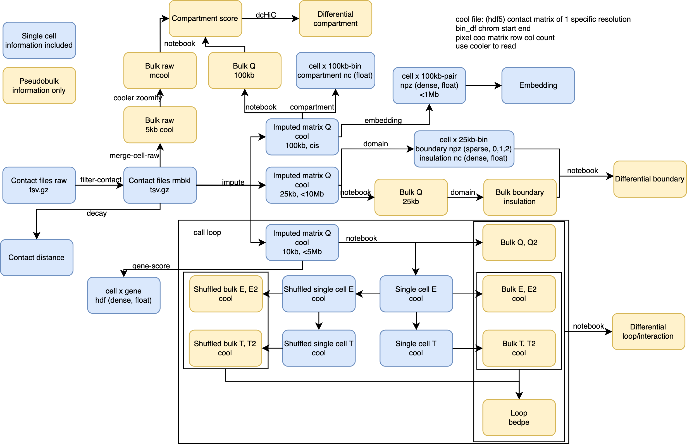

# scHiCluster

scHiCluster is a comprehensive python package for single-cell chromosome contact data analysis. It includes the functions and tutorials for 
- Identification of cell types (clusters)
- Loop calling in cell types
- Differential loop calling between cell types
- Domain calling in single cells
- Differential domain boundary calling between cell types
- Compartment calling in single cells
- Differential compartment calling between cell types
- Correlation between 3D genome features with other molecular modalities

