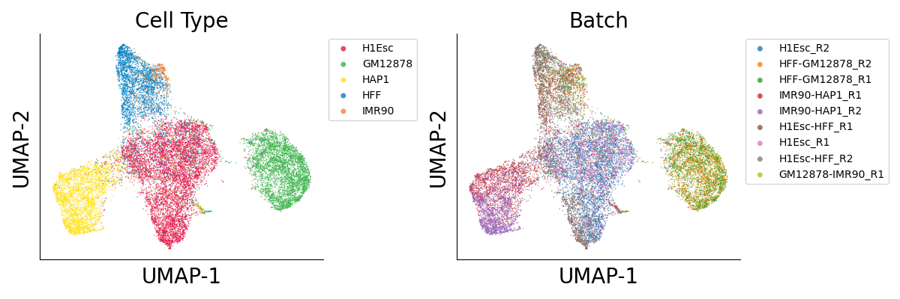

# 4DN cell line sci-HiC clustering
This is an example of the clustering framework using 4DN cell line data. All the 19,388 cells were included here. The separation between clusters will be better with additional filtering based on cell coverage.
## Download data 
```bash
wget -np -r -R "index.html*" https://noble.gs.washington.edu/proj/schic-topic-model/data/matrix_files/
wget -np -r -R "index.html*" https://noble.gs.washington.edu/proj/schic-topic-model/data/matrix_labels/
mkdir raw
mv noble.gs.washington.edu/proj/schic-topic-model/data/matrix_files/*tsv.gz raw/
mv noble.gs.washington.edu/proj/schic-topic-model/data/matrix_labels/* raw/
for f in $(ls raw/*tsv.gz); do tar -zxvf ${f}; done
mv raw/GM12878_IMR90.R1/ raw/GM12878-IMR90.R1/
```
## Prepare directories
```bash
ls raw/*/*matrix > raw_list.txt
cat <(for f in $(ls raw/*labeled); do awk -v f=$f '{printf("%s_%s\n",f,$0)}' $f; done) | sed 's/_500000.matrix//g' | sed 's|raw/||g' | sed 's/.R1.labeled/_R1/g' | sed 's/.R2.labeled/_R2/' > cell_list.txt
for c in `seq 1 22`; do mkdir -p cell_matrix/chr${c}/; mkdir -p imputed_matrix/chr${c}/; done
mkdir imputed_matrix/filelist/
mkdir -p imputed_matrix/merged/embed/
```
## Impute
```bash
# parallelize at cell level
res=500000
infile=$(cat raw_list.txt | head -${SGE_TASK_ID} | tail -1)
cell=$(echo $infile | sed 's/.R1/_R1/g' | sed 's/.R2/_R2/g' | cut -d/ -f2-3 | sed 's|/|_|g' | sed 's/_500000.matrix//g')
command time python code/raw2mat.py ${infile} cell_matrix/ ${cell} hg19.autosomal.chrom.sizes
for c in `seq 1 22`; do command time hicluster impute-cell --indir cell_matrix/chr${c}/ --outdir imputed_matrix/chr${c}/ --cell ${cell} --chrom ${c} --res ${res} --pad 1 --chrom_file hg19.autosomal.chrom.sizes; done
```
## Generate embedding
```bash
for c in `seq 1 22`; do awk -v c=$c '{printf("imputed_matrix/chr%s/%s_chr%s_pad1_std1_rp0.5_sqrtvc.hdf5\n",c,$1,c)}' cell_list.txt > imputed_matrix/filelist/imputelist_pad1_std1_rp0.5_sqrtvc_chr${c}.txt; echo $c; done
# parallelize at chromosome level
c=${SGE_TASK_ID}
command time hicluster embed-concatcell-chr --cell_list imputed_matrix/filelist/imputelist_pad1_std1_rp0.5_sqrtvc_chr${c}.txt --outprefix imputed_matrix/merged/embed/pad1_std1_rp0.5_sqrtvc_chr${c} --res ${res}

# merge chromosomes together
ls imputed_matrix/merged/embed/*npy > imputed_matrix/filelist/embedlist_pad1_std1_rp0.5_sqrtvc.txt
command time hicluster embed-mergechr --embed_list imputed_matrix/filelist/embedlist_pad1_std1_rp0.5_sqrtvc.txt --outprefix imputed_matrix/merged/embed/pad1_std1_rp0.5_sqrtvc
```
## Plot results
```python
import h5py
import numpy as np
import pandas as pd
from scipy.stats import ks_2samp
from UMAP import UMAP
from itertools import cycle, islice
import matplotlib as mpl
import matplotlib.pyplot as plt
from matplotlib import cm as cm
mpl.style.use('default')
mpl.rcParams['pdf.fonttype'] = 42
mpl.rcParams['ps.fonttype'] = 42

color = np.array(list(islice(cycle(['#e6194b','#3cb44b','#ffe119','#0082c8','#f58231','#911eb4','#46f0f0','#f032e6','#d2f53c','#fabebe','#008080','#e6beff','#aa6e28','#800000','#aaffc3','#808000','#ffd8b1','#000080','#808080','#fffac8','#000000']), 100)))

# load embedding
with h5py.File('imputed_matrix/merged/embed/pad1_std1_rp0.5_sqrtvc.svd50.hdf5', 'r') as f:
	matrix_reduce = f['data'][()]

# select dimension
for ndim in range(50):
	p = ks_2samp(matrix_reduce[:,ndim], matrix_reduce[:,ndim+1]).pvalue
	if p > 0.01:
		break

ndim += 1
print(ndim)

umap = UMAP(n_neighbors=25, random_state=0)
y = umap.fit_transform(matrix_reduce[:, :ndim])

label = pd.read_csv(f'cell_list.txt', sep='\t', header=None, index_col=0)
label['batch'] = ['_'.join(x.split('_')[:2]) for x in label.index]

ds = 1
fig, axes = plt.subplots(1, 2, figsize=(12,4))
for i,ax in enumerate(axes):
	ax.set_xlabel('UMAP-1', fontsize=20)
	ax.set_ylabel('UMAP-2', fontsize=20)
	ax.spines['right'].set_visible(False)
	ax.spines['top'].set_visible(False)
	ax.tick_params(axis='both', which='both', length=0)
	ax.set_xticklabels([])
	ax.set_yticklabels([])
	ax.set_title(['Cell Type', 'Batch'][i], fontsize=20)

ax = axes[0]
for i,x in enumerate(label[1].value_counts().index):
	cell = (label[1]==x)
	ax.scatter(y[cell, 0], y[cell, 1], c=color[i], s=ds, edgecolors='none', alpha=0.8, label=x, rasterized=True)

ax.legend(markerscale=5, prop={'size': 10}, bbox_to_anchor=(1,1), loc='upper left', fontsize=20)
ax = axes[1]
for i,x in enumerate(label['batch'].value_counts().index):
	cell = (label['batch']==x)
	ax.scatter(y[cell, 0], y[cell, 1], c='C'+str(i), s=ds, edgecolors='none', alpha=0.8, label=x, rasterized=True)

ax.legend(markerscale=5, prop={'size': 10}, bbox_to_anchor=(1,1), loc='upper left', fontsize=20)
plt.tight_layout()
plt.savefig(f'cell_19388_500k_pad1_std1_rp0.5_sqrtvc_u{ndim}_nn25.label.png', transparent=True, dpi=300)
plt.close()
```
  
