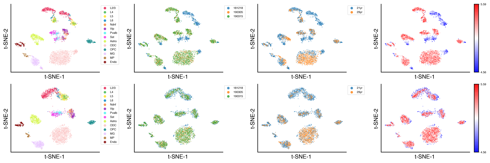
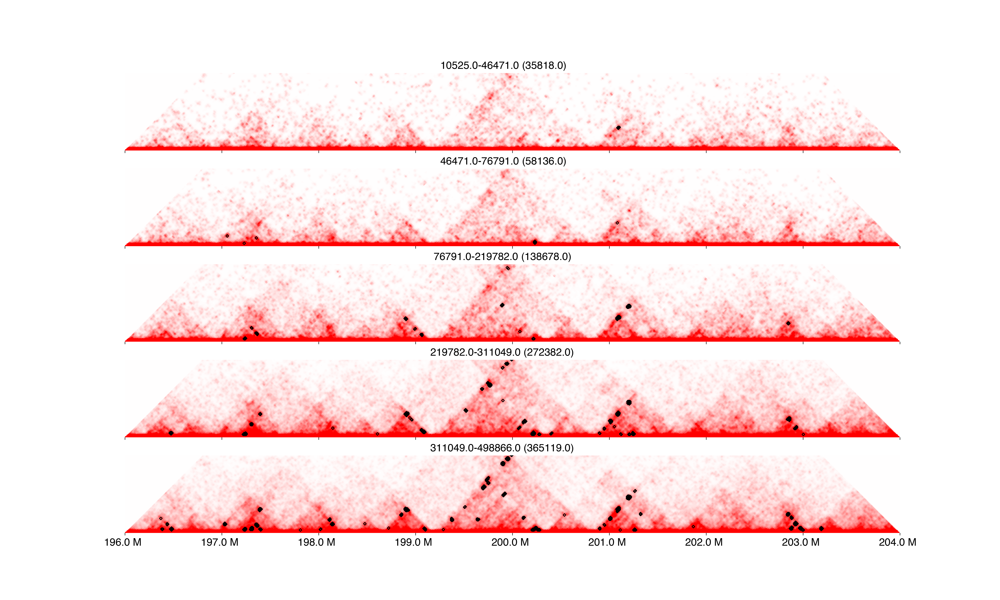
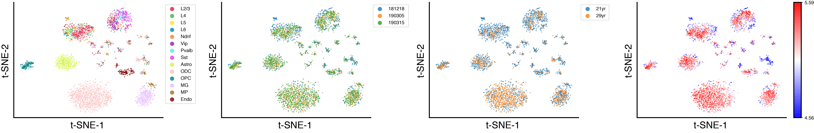
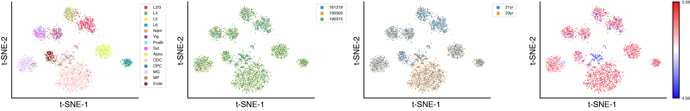
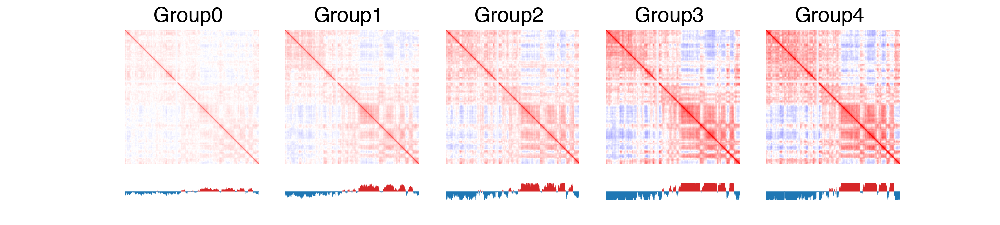
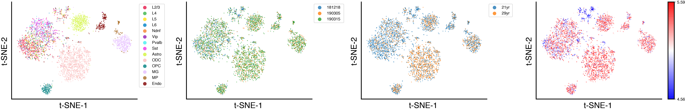

# Human prefrontal cortex snm3C-seq analysis
This is an example of analyzing 4238 cells from human prefrontal cortex ([Lee, Luo, Zhou et al. 2019](https://www.nature.com/articles/s41592-019-0547-z)). It includes [embedding](#clustering) and [compartment calling](#compartment-calling) at 100kb resolution, [domain calling](#domain-calling) at 25kb resolution, [loop calling](#loop-calling) at 10kb resolution. To estimate the power for 3D features calling, it also includes the example where L2/3 neurons were divided into 5 groups based on their coverage (~110 cells in each group), and the feature calling is performed within each group.

## Prepare directories
```bash
mkdir raw/ cell_matrix/ imputed_matrix/
for r in 10k 25k 100k; do for c in `seq 1 22`; do mkdir -p cell_matrix/${r}b_resolution/chr${c}/; mkdir -p imputed_matrix/${r}b_resolution/chr${c}/; done; mkdir imputed_matrix/${r}b_resolution/merged/; mkdir imputed_matrix/${r}b_resolution/bins/; done
```

## Generate matrices at multiple resolutions
```bash
# parallelize at cell level (4238 jobs in total)
cell=$(cut -f1 cell_4238_meta_cluster.txt | sed '1d' | head -${SGE_TASK_ID} | tail -1)
for r in 10 25 100; 
do
	command time hicluster generatematrix-cell --infile raw/${cell}.3C.sorted_contacts.txt.gz --outdir cell_matrix/${r}kb_resolution/ --chrom_file /gale/netapp/home/zhoujt/genome/hg19/hg19.autosomal.chrom.sizes --res ${r}000 --cell ${cell} --chr1 1 --pos1 2 --chr2 3 --pos2 4;
done
```

## Clustering
### Impute at 100kb resolution
```bash
# parallelize at cell level (4238 jobs in total)
cell=$(cut -f1 cell_4238_meta_cluster.txt | sed '1d' | head -${SGE_TASK_ID} | tail -1)
res0=100k
res=100000
for c in `seq 1 22`; 
do 
	command time hicluster impute-cell --indir cell_matrix/${res0}b_resolution/chr${c}/ --outdir imputed_matrix/${res0}b_resolution/chr${c}/ --cell ${cell} --chrom ${c} --res ${res} --pad 1 --chrom_file hg19.autosomal.chrom.sizes; 
done
```

### Generate embedding
```bash
for c in `seq 1 22`; do awk -v c=$c '{printf("imputed_matrix/100kb_resolution/chr%s/%s_chr%s_pad1_std1_rp0.5_sqrtvc.hdf5\n",c,$1,c)}' cell_4238_meta_cluster.txt > imputed_matrix/100kb_resolution/filelist/imputelist_pad1_std1_rp0.5_sqrtvc_chr${c}.txt; echo $c; done
# parallelize at chromosome level (22 jobs in total)
c=${SGE_TASK_ID}
command time hicluster embed-concatcell-chr --cell_list imputed_matrix/100kb_resolution/filelist/imputelist_pad1_std1_rp0.5_sqrtvc_chr${c}.txt --outprefix imputed_matrix/100kb_resolution/merged/embed/pad1_std1_rp0.5_sqrtvc_chr${c} --res ${res}

# merge chromosomes together
ls imputed_matrix/100kb_resolution/merged/embed/*npy > imputed_matrix/100kb_resolution/filelist/embedlist_pad1_std1_rp0.5_sqrtvc.txt
command time hicluster embed-mergechr --embed_list imputed_matrix/100kb_resolution/filelist/embedlist_pad1_std1_rp0.5_sqrtvc.txt --outprefix imputed_matrix/100kb_resolution/merged/embed/pad1_std1_rp0.5_sqrtvc
```

### Plot results
```python
import h5py
import numpy as np
import pandas as pd
from itertools import cycle, islice
import harmonypy as hm
from MulticoreTSNE import MulticoreTSNE
import matplotlib as mpl
import matplotlib.pyplot as plt
from matplotlib import cm as cm
mpl.style.use('default')
mpl.rcParams['pdf.fonttype'] = 42
mpl.rcParams['ps.fonttype'] = 42
mpl.rcParams['axes.linewidth'] = 2

color = np.array(list(islice(cycle(['#e6194b','#3cb44b','#ffe119','#0082c8','#f58231','#911eb4','#46f0f0','#f032e6','#d2f53c','#fabebe','#008080','#e6beff','#aa6e28','#800000','#aaffc3','#808000','#ffd8b1','#000080','#808080','#fffac8','#000000']), 100)))

meta = pd.read_csv('cell_4238_meta_cluster.txt', sep='\t', header=0)
meta.index = ['_'.join([x.split('_')[i] for i in [0,3,-3,-2,-1]]) for x in meta['cell_id']]
meta['date'] = np.array([x.split('_')[0] for x in meta.index])
meta['indiv'] = np.array([x.split('_')[1] for x in meta.index])
meta['batch'] = meta['date'] + meta['indiv']

res0 = '100k'
res = 100000
mode = 'pad1_std1_rp0.5_sqrtvc'
with h5py.File(f'imputed_matrix/100kb_resolution/merged/embed/{mode}.svd50.hdf5', 'r') as f:
	matrix_reduce = f['data'][()]

ndim = 15
tsne = MulticoreTSNE(perplexity=50, verbose=3, random_state=0, n_jobs=10, init=matrix_reduce[:, :2]/np.std(matrix_reduce[:, 0])*0.0001)
yu = tsne.fit_transform(matrix_reduce[:, :ndim])

# batch effect correction with harmonypy
ho = hm.run_harmony(matrix_reduce[:,:ndim], meta, 'batch', max_iter_harmony=30, random_state=0)
matrix_reduce_hm = ho.Z_corr.T
tsne = MulticoreTSNE(perplexity=50, verbose=3, random_state=0, n_jobs=10, init=matrix_reduce_hm[:, :2]/np.std(matrix_reduce_hm[:, 0])*0.0001)
yhmu = tsne.fit_transform(matrix_reduce_hm[:, :ndim])

# plot clusters, batches, and coverage before and after correction
leg = np.array(['L2/3', 'L4', 'L5', 'L6', 'Ndnf', 'Vip', 'Pvalb', 'Sst', 'Astro', 'ODC', 'OPC', 'MG', 'MP', 'Endo'])
ds = 3
fig, axes = plt.subplots(2,4,figsize=(24,8))
for k,y in enumerate([yu, yhmu]):
	for ax in axes[k]:
		ax.set_xlabel('t-SNE-1', fontsize=20)
		ax.set_ylabel('t-SNE-2', fontsize=20)
		ax.spines['right'].set_visible(False)
		ax.spines['top'].set_visible(False)
		ax.tick_params(axis='both', which='both', length=0)
		ax.set_xticklabels([])
		ax.set_yticklabels([])
	ax = axes[k,0]
	for i,x in enumerate(leg):
		cell = (meta['clusters']==x)
		ax.scatter(y[cell, 0], y[cell, 1], c=color[i], s=ds, edgecolors='none', alpha=0.8, label=x, rasterized=True)
	divider = make_axes_locatable(ax)
	cax = divider.append_axes('right', size='5%', pad='5%')
	cax.axis('off')
	ax.legend(markerscale=5, prop={'size': 10}, bbox_to_anchor=(1,1), loc='upper left', fontsize=20)
	ax = axes[k,1]
	for i,x in enumerate(np.sort(list(set(meta['date'])))):
		cell = (meta['date']==x)
		ax.scatter(y[cell, 0], y[cell, 1], c='C'+str(i), s=ds, edgecolors='none', alpha=0.8, label=x, rasterized=True)
	divider = make_axes_locatable(ax)
	cax = divider.append_axes('right', size='5%', pad='5%')
	cax.axis('off')
	ax.legend(markerscale=5, prop={'size': 10}, bbox_to_anchor=(1,1), loc='upper left', fontsize=20)
	ax = axes[k,2]
	for i,x in enumerate(np.sort(list(set(meta['indiv'])))):
		cell = (meta['indiv']==x)
		ax.scatter(y[cell, 0], y[cell, 1], c='C'+str(i), s=ds, edgecolors='none', alpha=0.8, label=x, rasterized=True)
	divider = make_axes_locatable(ax)
	cax = divider.append_axes('right', size='5%', pad='5%')
	cax.axis('off')
	ax.legend(markerscale=5, prop={'size': 10}, bbox_to_anchor=(1,1), loc='upper left', fontsize=20)
	ax = axes[k,3]
	mch = np.log10(meta['#contact'].values)
	vmin, vmax = np.around([np.percentile(mch,5), np.percentile(mch,95)], decimals=2)
	plot = ax.scatter(y[:, 0], y[:, 1], s=ds, c=mch, alpha=0.8, edgecolors='none', cmap=cm.bwr, vmin=vmin, vmax=vmax, rasterized=True)
	divider = make_axes_locatable(ax)
	cax = divider.append_axes('right', size='5%', pad='5%')
	cbar = plt.colorbar(plot, cax=cax)
	cbar.solids.set_clim([vmin, vmax])
	cbar.set_ticks([vmin, vmax])
	cbar.draw_all()

plt.tight_layout()
plt.savefig(f'plot/cell_4238_100k_{mode}_dist10M_u{ndim}.batch_cluster.pdf', transparent=True)
plt.close()
```
  

## Group L2/3 cells based on coverage
```python
import numpy as np
import pandas as pd

meta = pd.read_csv('cell_4238_meta_cluster.txt', sep='\t', header=0, index_col=0)
clustermeta = meta[meta['clusters']=='L2/3']
group, binedge = pd.qcut(clustermeta['#contact'], 5, labels=np.arange(5), retbins=True)
for i in range(5):
	np.savetxt(f'L23_covgroup{i}_celllist.txt', group[group==i].index, delimiter='\n', fmt='%s')

```

## Loop calling
### Impute at 10kb resolution and compute local background
We start by impute matrices at 10kb resolution. The running time of random walk increases cubically with the dimension of a matrix, which makes the imputation at 10kb resolution very slow for large chromosomes. However, at 10kb resolution, we usually only care about the contacts within certain distance (e.g. < 10 Mb). This allowed us to use a sliding window method to speed up the computation. Specifically, we only compute random walk within the square matrix of dimension w, and move downstreamly by step size of s. The imputation results of these windows are merged to generate the final imputation. Empirically when computing a matrix > 12000 dimensions (human chr1-chr12), the sliding window of size 30-40M will significantly accelerate the imputation and returns accurate results of contacts within 10M.  
After imputation, the matrix is normalized by the decay with a Z-score transform at each insertion distance, and the differences between each pixel and its local background is also saved for later t-tests of loop candidates.
```bash
# parallelize at cell level (4238 jobs in total)
cell=$(cut -f1 cell_4238_meta_cluster.txt | sed '1d' | head -${SGE_TASK_ID} | tail -1)
res0=10k
res=10000
for c in `seq 1 12`; 
do 
	command time hicluster impute-cell --indir cell_matrix/${res0}b_resolution/chr${c}/ --outdir imputed_matrix/${res0}b_resolution/chr${c}/ --cell ${cell} --chrom ${c} --res ${res} --chrom_file hg19.autosomal.chrom.sizes --pad 2 --output_dist 10050000 --window_size 30000000 --step_size 10000000 --mode pad2_std1_rp0.5_sqrtvc; 
	command time hicluster loop-bkg-cell --indir imputed_matrix/${res0}b_resolution/ --cell ${cell} --chrom ${c} --res ${res} --impute_mode pad2_std1_rp0.5_sqrtvc; 
done
for c in `seq 13 22`; 
do 
	command time hicluster impute-cell --indir cell_matrix/${res0}b_resolution/chr${c}/ --outdir imputed_matrix/${res0}b_resolution/chr${c}/ --cell ${cell} --chrom ${c} --res ${res} --chrom_file hg19.autosomal.chrom.sizes --pad 2 --output_dist 10050000 --mode pad2_std1_rp0.5_sqrtvc; 
	command time hicluster loop-bkg-cell --indir imputed_matrix/${res0}b_resolution/ --cell ${cell} --chrom ${c} --res ${res} --impute_mode pad2_std1_rp0.5_sqrtvc; 
done
```

### Sum cells
The next step is to sum the matrices of single cells within the same coverage group.
```bash
mode=pad2_std1_rp0.5_sqrtvc
# write lists of cells to be summed
for i in `seq 0 4`; do for c in `seq 1 22`; do awk -v c=$c -v m=$mode '{printf("imputed_matrix/10kb_resolution/chr%s/%s_chr%s_%s\n",c,$1,c,m)}' L23_covgroup${i}_celllist.txt > imputed_matrix/10kb_resolution/filelist/L23_covgroup${i}_${mode}_chr${c}_looplist.txt; done; done

# merge cells by coverage groups
# generate a list of parameters
cat <(for c in `seq 1 22`; do for i in `seq 0 4`; do echo $i $c $mode; done; done) | sort -k2,2n -k1,1rn > paralist.txt 
for i in `seq 0 4`; do mkdir -p imputed_matrix/merged/L23_covgroup${i}_${mode}/; done

# parallelize at group x chromosome level (110 jobs in total)
file=paralist.txt
c=$(cut -f2 -d' ' ${file} | head -${SGE_TASK_ID} | tail -1)
i=$(cut -f1 -d' ' ${file} | head -${SGE_TASK_ID} | tail -1)
mode=$(cut -f3 -d' ' ${file} | head -${SGE_TASK_ID} | tail -1)
command time hicluster loop-sumcell-chr --cell_list imputed_matrix/10kb_resolution/filelist/L23_covgroup${i}_${mode}_chr${c}_looplist.txt --outprefix imputed_matrix/10kb_resolution/merged/L23_covgroup${i}_${mode}/L23_covgroup${i}_${mode}_dist_trim_chr${c} --res 10000

# merge chromosomes to generate final loop summary
for i in `seq 0 4`; 
do 
	command time hicluster loop-mergechr --inprefix imputed_matrix/10kb_resolution/merged/L23_covgroup${i}_${mode}/L23_covgroup${i}_${mode}_dist_trim --outprefix imputed_matrix/10kb_resolution/merged/L23_covgroup${i}_${mode}/L23_covgroup${i}_${mode}_dist_trim --chrom_file hg19.autosomal.chrom.sizes;
done
```

### Plot results
The following python script visualize the loop calling result at the flanking region of SATB2 gene in each coverage group. 'clustermeta' and 'binedge' are defined [above](#group-l23-cells-based-on-coverage).
```python
import h5py
import numpy as np
import pandas as pd
from scipy import ndimage as nd
from statsmodels.sandbox.stats.multicomp import multipletests as FDR
import matplotlib as mpl
import matplotlib.pyplot as plt
from matplotlib import cm as cm
mpl.style.use('default')
mpl.rcParams['pdf.fonttype'] = 42
mpl.rcParams['ps.fonttype'] = 42
mpl.rcParams['axes.linewidth'] = 2

res = 10000
l, r = 196000000, 204000000
mode = 'pad2_std1_rp0.5_sqrtvc'
dstall = []
for i in range(5):
	with h5py.File(f'imputed_matrix/10kb_resolution/merged/L23_covgroup{i}_{mode}/L23_covgroup{i}_{mode}_dist_trim.chr2.hdf5', 'r') as f:
		g = f['Matrix']
		A = csr_matrix((g['data'][()], g['indices'][()], g['indptr'][()]), g.attrs['shape'])
	tmp = A[(l//10000):(r//10000),(l//10000):(r//10000)].toarray()
	dst = nd.rotate(tmp, 45, order=0, reshape=True, prefilter=False, cval=0)
	dstall.append(dst)

loop = []
for i in range(5):
	data = pd.read_csv(f'imputed_matrix/10kb_resolution/merged/L23_covgroup{i}_{mode}/L23_covgroup{i}_{mode}_dist_trim.loop.bedpe', sep='\t', header=None, index_col=None)
	data = data[(data[4]<r) & (data[1]>=l) & (data[4]-data[1]>(5*res))][[1,4]].values // res
	loop.append(np.array([(data[:,1]+data[:,0]-2*l//res)/np.sqrt(2), (data[:,1]-data[:,0])/np.sqrt(2)]))

fig, axes = plt.subplots(5, 1, figsize=(20, 12))
for i, ax in enumerate(axes):
	ax.spines['right'].set_visible(False)
	ax.spines['top'].set_visible(False)
	ax.spines['bottom'].set_visible(False)
	ax.spines['left'].set_visible(False)
	img = ax.imshow(dstall[i], cmap='bwr', vmin=-100/A.shape[0], vmax=100/A.shape[0])
	h = len(dstall[i])
	ax.set_ylim([0.5*h, 0.4*h])
	ax.set_xlim([0, h])
	ax.set_yticks([])
	ax.set_yticklabels([])
	ax.set_xticks([h*i*1000000/(r-l) for i in range((r-l)//1000000 + 1)])
	ax.set_xticklabels([])
	ax.scatter(loop[i][0], 0.5*h-loop[i][1], marker='D', s=8, c='none', edgecolors='k')
	ax.set_title(str(np.around(binedge[i])) + '-' + str(np.around(binedge[i+1])) + ' (' + str(np.around(clustermeta[group==i]['#contact'].mean())) + ')', fontsize=15)

axes[-1].set_xticklabels([str(x/1000000)+' M' for x in range(l,r+1,1000000)], fontsize=15)
plt.savefig(f'plot/L23_10k_{mode}_dist_trim.covgroup.loop.pdf', transparent=True)
plt.close()
```
  

### Sum groups
```bash
# write list of groups and cells to be summed
for c in `seq 1 22`; do ls imputed_matrix/10kb_resolution/merged/L23_covgroup?_${mode}/L23_covgroup?_${mode}_dist_trim_chr${c}.hdf5 | sed 's/.hdf5//g' > imputed_matrix/10kb_resolution/filelist/L23_${mode}_chr${c}_grouplist.txt; cat imputed_matrix/10kb_resolution/filelist/L23_covgroup?_${mode}_chr${c}_looplist.txt > imputed_matrix/10kb_resolution/filelist/L23_${mode}_chr${c}_looplist.txt; done

# merge groups
mkdir -p imputed_matrix/merged/L23_${mode}/;

# parallelize at chromosome level (22 jobs in total)
c=${SGE_TASK_ID}
mode=pad2_std1_rp0.5_sqrtvc
command time hicluster loop-sumcell-chr --cell_list imputed_matrix/10kb_resolution/filelist/L23_${mode}_chr${c}_looplist.txt --group_list imputed_matrix/10kb_resolution/filelist/L23_${mode}_chr${c}_grouplist.txt --outprefix imputed_matrix/10kb_resolution/merged/L23_${mode}/L23_${mode}_dist_trim_chr${c} --res 10000

# merge chromosomes to generate final loop summary
command time hicluster loop-mergechr --inprefix imputed_matrix/10kb_resolution/merged/L23_${mode}/L23_${mode}_dist_trim --outprefix imputed_matrix/10kb_resolution/merged/L23_${mode}/L23_${mode}_dist_trim --chrom_file hg19.autosomal.chrom.sizes
```

## Generate 25kb and 100kb bins bed file
These files are required during domain calling and compartment calling, respectively.
```python
chromsize = pd.read_csv('hg19.autosomal.chrom.sizes', sep='\t', header=None, index_col=0).to_dict()[1]
for res,res0 in [[25000, '25k'], [100000, '100k']]:
	for c in chromsize:
		ngene = int(chromsize[c]//res) + 1
		bed = [['chr'+c, i*res, (i+1)*res] for i in range(ngene)]
		bed[-1][-1] = chromsize[c]
		np.savetxt(f'imputed_matrix/{res0}b_resolution/bins/chr{c}.bed', bed, fmt='%s', delimiter='\t')
		print(res, c)
```

## Domain calling
### Impute at 25kb resolution and compute insulation scores and domains
```bash
# parallelize at cell level (4238 jobs in total)
cell=$(cut -f1 cell_4238_meta_cluster.txt | sed '1d' | head -${SGE_TASK_ID} | tail -1)
res0=25k
res=25000
mode=pad2_std1_rp0.5_sqrtvc
for c in `seq 1 22`; 
do 
	command time hicluster impute-cell --indir cell_matrix/${res0}b_resolution/chr${c}/ --outdir imputed_matrix/${res0}b_resolution/chr${c}/ --cell ${cell} --chrom ${c} --res ${res} --chrom_file hg19.autosomal.chrom.sizes --pad 2 --output_dist 10050000 --mode ${mode}; 
	command time hicluster domain-insulation-cell --indir imputed_matrix/${res0}b_resolution/ --cell ${cell} --chrom ${c} --mode ${mode} --w 10 
	command time Rscript domain_topdom_cell.R ${cell} ${c} ${mode} 10 imputed_matrix/${res0}b_resolution/ imputed_matrix/${res0}b_resolution/
done
```

### Concatenate cells
```bash
mode=pad2_std1_rp0.5_sqrtvc
# write domain and insulation file list
for c in `seq 1 22`; do awk -v c=$c -v m=$mode '{printf("imputed_matrix/25kb_resolution/chr%s/%s_chr%s_%s.w10.domain.bed\n",c,$1,c,m)}' cell_4238_meta_cluster.txt > imputed_matrix/25kb_resolution/filelist/imputelist_${mode}_chr${c}.txt; awk -v c=$c -v m=$mode '{printf("imputed_matrix/25kb_resolution/chr%s/%s_chr%s_%s.w10.ins.npy\n",c,$1,c,m)}' cell_4238_meta_cluster.txt > imputed_matrix/25kb_resolution/filelist/inslist_${mode}_chr${c}.txt; done

# parallelize at chromosome level (22 jobs in total)
c=${SGE_TASK_ID}
command time hicluster domain-concatcell-chr --cell_list imputed_matrix/25kb_resolution/filelist/inslist_${mode}_chr${c}.txt --outprefix imputed_matrix/25kb_resolution/merged/${mode}_chr${c}.w10 --res 25000 --input_type insulation --ncpus 10
command time hicluster domain-concatcell-chr --cell_list imputed_matrix/25kb_resolution/filelist/domainlist_${mode}_chr${c}.txt --outprefix imputed_matrix/25kb_resolution/merged/${mode}_chr${c}.w10 --res 25000 --input_type boundary --ncpus 10
``` 

### Embed with insulation scores
```python
res0 = '25k'
mode = 'pad2_std1_rp0.5_sqrtvc'
indir = f'imputed_matrix/{res0}b_resolution/merged/'
ins = np.concatenate([np.load(f'{indir}{mode}_chr{c}.w10.insulation.npy') for c in chrom], axis=1)

pca = PCA(n_components=50, random_state=0, svd_solver='arpack')
ins_reduce = pca.fit_transform(ins)
ins_u = ins_reduce / pca.singular_values_

ndim = 15
ho = hm.run_harmony(ins_u[:,:ndim], meta, 'batch', max_iter_harmony=30, random_state=0)
ins_u_hm = ho.Z_corr.T
tsne = MulticoreTSNE(perplexity=50, verbose=3, random_state=0, n_jobs=10, init=ins_u_hm[:, :2]/np.std(ins_u_hm[:, 0])*0.0001)
y = tsne.fit_transform(ins_u_hm[:, :ndim])

ds = 3
fig, axes = plt.subplots(1,4,figsize=(24,4))
for ax in axes:
	ax.set_xlabel('t-SNE-1', fontsize=20)
	ax.set_ylabel('t-SNE-2', fontsize=20)
	ax.spines['right'].set_visible(False)
	ax.spines['top'].set_visible(False)
	ax.tick_params(axis='both', which='both', length=0)
	ax.set_xticklabels([])
	ax.set_yticklabels([])

ax = axes[0]
for i,x in enumerate(leg):
	cell = (meta['clusters']==x)
	ax.scatter(y[cell, 0], y[cell, 1], c=color[i], s=ds, edgecolors='none', alpha=0.8, label=x, rasterized=True)

divider = make_axes_locatable(ax)
cax = divider.append_axes('right', size='5%', pad='5%')
cax.axis('off')
ax.legend(markerscale=5, prop={'size': 10}, bbox_to_anchor=(1,1), loc='upper left', fontsize=20)
ax = axes[1]
for i,x in enumerate(np.sort(list(set(meta['date'])))):
	cell = (meta['date']==x)
	ax.scatter(y[cell, 0], y[cell, 1], c='C'+str(i), s=ds, edgecolors='none', alpha=0.8, label=x, rasterized=True)

divider = make_axes_locatable(ax)
cax = divider.append_axes('right', size='5%', pad='5%')
cax.axis('off')
ax.legend(markerscale=5, prop={'size': 10}, bbox_to_anchor=(1,1), loc='upper left', fontsize=20)

ax = axes[2]
for i,x in enumerate(np.sort(list(set(meta['indiv'])))):
	cell = (meta['indiv']==x)
	ax.scatter(y[cell, 0], y[cell, 1], c='C'+str(i), s=ds, edgecolors='none', alpha=0.8, label=x, rasterized=True)

divider = make_axes_locatable(ax)
cax = divider.append_axes('right', size='5%', pad='5%')
cax.axis('off')
ax.legend(markerscale=5, prop={'size': 10}, bbox_to_anchor=(1,1), loc='upper left', fontsize=20)

ax = axes[3]
mch = np.log10(meta['#contact'].values)
vmin, vmax = np.around([np.percentile(mch,5), np.percentile(mch,95)], decimals=2)
plot = ax.scatter(y[:, 0], y[:, 1], s=ds, c=mch, alpha=0.8, edgecolors='none', cmap=cm.bwr, vmin=vmin, vmax=vmax, rasterized=True)
divider = make_axes_locatable(ax)
cax = divider.append_axes('right', size='5%', pad='5%')
cbar = plt.colorbar(plot, cax=cax)
cbar.solids.set_clim([vmin, vmax])
cbar.set_ticks([vmin, vmax])
cbar.draw_all()

plt.tight_layout()
plt.savefig(f'plot/cell_4238_{res0}_{mode}_dim{ndim}_ins.batch_cluster.pdf', transparent=True)
plt.close()
```
  

### Embed with domain boundaries
```python
from scipy.sparse import hstack, load_npz

domain = hstack([load_npz(f'{indir}{mode}_chr{c}.w10.boundary.npz') for c in chrom])
rowsum = domain.getnnz(axis=1)
print(np.sum(rowsum>1000))
colsum = domain.getnnz(axis=0)
binfilter = (colsum>5)
np.sum(binfilter)
domain = domain.tocsc()[:,binfilter]
colsum = colsum[binfilter]

binfilter = (np.abs(zscore(np.log(colsum)))<2)
print(np.sum(binfilter), colsum[binfilter].min(), colsum[binfilter].max())

domain = domain[:, binfilter]

scalefactor = 100000
idf = np.log(1 + domain.shape[0] / domain.getnnz(axis=0))
tf = domain.tocsr()
tf.data = tf.data / np.repeat(rowsum, domain.getnnz(axis=1))
tf.data = np.log(tf.data * scalefactor + 1)
tf = tf.multiply(idf)
svd = TruncatedSVD(n_components=50, algorithm='arpack')
matrix_reduce = svd.fit_transform(tf)
matrix_reduce = matrix_reduce / svd.singular_values_

ndim = 15
ho = hm.run_harmony(matrix_reduce[:, :ndim], meta, 'batch', max_iter_harmony=30, random_state=0)
matrix_reduce_hm = ho.Z_corr.T
tsne = MulticoreTSNE(perplexity=50, verbose=3, random_state=0, n_jobs=10, init=matrix_reduce_hm[:, :2]/np.std(matrix_reduce_hm[:, 0])*0.0001)
y = tsne.fit_transform(matrix_reduce_hm[:, :ndim])

ds = 3
fig, axes = plt.subplots(1,4,figsize=(24,4))
for ax in axes:
	ax.set_xlabel('t-SNE-1', fontsize=20)
	ax.set_ylabel('t-SNE-2', fontsize=20)
	ax.spines['right'].set_visible(False)
	ax.spines['top'].set_visible(False)
	ax.tick_params(axis='both', which='both', length=0)
	ax.set_xticklabels([])
	ax.set_yticklabels([])

ax = axes[0]
for i,x in enumerate(leg):
	cell = (meta['clusters']==x)
	ax.scatter(y[cell, 0], y[cell, 1], c=color[i], s=ds, edgecolors='none', alpha=0.8, label=x, rasterized=True)

divider = make_axes_locatable(ax)
cax = divider.append_axes('right', size='5%', pad='5%')
cax.axis('off')
ax.legend(markerscale=5, prop={'size': 10}, bbox_to_anchor=(1,1), loc='upper left', fontsize=20)

ax = axes[1]
for i,x in enumerate(np.sort(list(set(meta['date'])))):
	cell = (meta['date']==x)
	ax.scatter(y[cell, 0], y[cell, 1], c='C'+str(i), s=ds, edgecolors='none', alpha=0.8, label=x, rasterized=True)

divider = make_axes_locatable(ax)
cax = divider.append_axes('right', size='5%', pad='5%')
cax.axis('off')
ax.legend(markerscale=5, prop={'size': 10}, bbox_to_anchor=(1,1), loc='upper left', fontsize=20)

ax = axes[2]
for i,x in enumerate(np.sort(list(set(meta['indiv'])))):
	cell = (meta['indiv']==x)
	ax.scatter(y[cell, 0], y[cell, 1], c='C'+str(i), s=ds, edgecolors='none', alpha=0.8, label=x, rasterized=True)

divider = make_axes_locatable(ax)
cax = divider.append_axes('right', size='5%', pad='5%')
cax.axis('off')
ax.legend(markerscale=5, prop={'size': 10}, bbox_to_anchor=(1,1), loc='upper left', fontsize=20)

ax = axes[3]
mch = np.log10(meta['#contact'].values)
vmin, vmax = np.around([np.percentile(mch,5), np.percentile(mch,95)], decimals=2)
plot = ax.scatter(y[:, 0], y[:, 1], s=ds, c=mch, alpha=0.8, edgecolors='none', cmap=cm.bwr, vmin=vmin, vmax=vmax, rasterized=True)
divider = make_axes_locatable(ax)
cax = divider.append_axes('right', size='5%', pad='5%')
cbar = plt.colorbar(plot, cax=cax)
cbar.solids.set_clim([vmin, vmax])
cbar.set_ticks([vmin, vmax])
cbar.draw_all()

plt.tight_layout()
plt.savefig('plot/cell_4238_{res0}_{mode}_boundary_w10_colsum5_logzscore2_tfidf_u{ndim}.batch_cluster.pdf', transparent=True)
plt.close()

```
  

### Visualize boundary probability
```python
c = '2'
ct = 'L2/3'
res = 25000

domain = load_npz(f'{indir}{mode}_chr{c}.w10.boundary.npz')[meta['clusters']==ct]
prob = np.array([domain[group==i].sum(axis=0).A.ravel() / np.sum(group==i) for i in range(5)])
with h5py.File(f'imputed_matrix/10kb_resolution/merged/L23_{mode}/L23_{mode}_dist_trim.chr2.O.hdf5', 'r') as f:
	g = f['Matrix']
	A = csr_matrix((g['data'][()], g['indices'][()], g['indptr'][()]), g.attrs['shape'])

l, r = 196000000, 204000000
tmp = A[(l//10000):(r//10000),(l//10000):(r//10000)].toarray()
dst = nd.rotate(tmp, 45, order=0, reshape=True, prefilter=False, cval=0)

fig, axes = plt.subplots(6, 1, figsize=(20, 8), gridspec_kw={'height_ratios': [3,1,1,1,1,1], 'hspace':0.4})
ax = axes[0]
ax.spines['right'].set_visible(False)
ax.spines['top'].set_visible(False)
ax.spines['bottom'].set_visible(False)
ax.spines['left'].set_visible(False)
img = ax.imshow(dst, cmap='bwr', vmin=-0.15, vmax=0.15)
h = len(dst)
ax.set_ylim([0.5*h, 0.4*h])
ax.set_xlim([0, h])
ax.set_yticks([])
ax.set_yticklabels([])
ax.set_xticks([])
ax.set_xticklabels([])

for i,ax in enumerate(axes[1:][::-1]):
	ax.spines['top'].set_visible(False)
	ax.plot(np.arange(l//res, r//res), prob[i, (l//res):(r//res)], linewidth=2.5)
	ax.set_ylim([0, 0.35])
	ax.set_yticks([0, 0.3])
	ax.set_yticklabels([0, 0.3], fontsize=15)
	ax.set_xlim([l//res, r//res])
	ax.set_xticks([x//res for x in range(l,r+1,1000000)])
	ax.set_xticklabels([])
	ax.set_title(str(np.around(binedge[i])) + '-' + str(np.around(binedge[i+1])) + ' (' + str(np.around(clustermeta[group==i]['#contact'].mean())) + ')', fontsize=15)

axes[-1].set_xticklabels([str(x/1000000)+' M' for x in range(l,r+1,1000000)], fontsize=15)

plt.savefig(f'plot/L23_{res0}_{mode}.covgroup.boundprob.w10.pdf', transparent=True)
plt.close()
```
  

## Compartment calling
### Compartment calling within cell groups

```bash
mode=pad1_std1_rp0.5_sqrtvc
# write lists of cells to be summed
for i in `seq 0 4`; do for c in `seq 1 22`; do awk -v c=$c -v m=$mode '{printf("imputed_matrix/100kb_resolution/chr%s/%s_chr%s_%s\n",c,$1,c,m)}' L23_covgroup${i}_celllist.txt > imputed_matrix/100kb_resolution/filelist/imputelist_L23_covgroup${i}_${mode}_chr${c}.txt; done; done

# merge cells by coverage groups
# generate a list of parameters
cat <(for c in `seq 1 22`; do for i in `seq 0 4`; do echo $i $c $mode; done; done) | sort -k2,2n -k1,1rn > paralist.txt 
for i in `seq 0 4`; do mkdir -p imputed_matrix/merged/L23_covgroup${i}_${mode}/; done

# parallelize at group x chromosome level (110 jobs in total)
file=paralist.txt
c=$(cut -f2 -d' ' ${file} | head -${SGE_TASK_ID} | tail -1)
i=$(cut -f1 -d' ' ${file} | head -${SGE_TASK_ID} | tail -1)
mode=$(cut -f3 -d' ' ${file} | head -${SGE_TASK_ID} | tail -1)
command time hicluster loop-sumcell-chr --cell_list imputed_matrix/100kb_resolution/filelist/imputelist_L23_covgroup${i}_${mode}_chr${c}.txt --outprefix imputed_matrix/100kb_resolution/merged/L23_covgroup${i}_${mode}_chr${c} --res 100000 --matrix Q
```

### Visualize correlation matrix
```python
c = '2'
res0 = '100k'
mode = 'pad1_std1_rp0.5_sqrtvc'
indir = f'imputed_matrix/{res0}b_resolution/merged/'
corr_matrix = []
for i in range(5):
	start_time = time.time()
	with h5py.File(f'{indir}/L23_covgroup{i}_{mode}_chr{c}.hdf5', 'r') as f:
		g = f['Matrix']
		E = csr_matrix((g['data'][()], g['indices'][()], g['indptr'][()]), g.attrs['shape']).tocoo()
	ngene = E.shape[0]
	top = np.array([np.percentile(E.diagonal(i), 99) for i in range(ngene)])
	E.data = np.min([E.data, top[E.col - E.row]], axis=0)
	ave = np.array([np.mean(E.diagonal(i)) for i in range(ngene)])
	ave[ave==0] = 1
	E.data = E.data / ave[E.col - E.row]
	E = E + E.T
	C = np.corrcoef(E.toarray())
	C[np.isnan(C)] = 0
	corr_matrix.append(C)
	print(i, time.time()-start_time)

pca = PCA(n_components=2, random_state=0, svd_solver='arpack')
comp = pca.fit_transform(np.concatenate(corr_matrix, axis=0))
comp = comp[:,0].reshape((5,-1))
fig, axes = plt.subplots(nrows=2, ncols=5, gridspec_kw={'height_ratios': [4,0.5]}, figsize=(10, 2.25), sharey='row')
for i in range(5):
	ax = axes[0, i]
	sns.despine(bottom=True, left=True, ax=ax)
	plot = ax.imshow(corr_matrix[i], cmap='bwr', vmin=-0.6, vmax=0.6)
	ax.set_title(f'Group{i}', fontsize=15)
	ax.set_xticks([])
	ax.set_yticks([])
	ax.set_xlim([-0.5, ngene-0.5])
	ax.set_ylim([ngene-0.5, -0.5])
	ax = axes[1, i]
	sns.despine(bottom=True, left=True, ax=ax)
	x, y = np.arange(ngene), comp[i]
	ax.fill_between(x, y, 0, where=y >= 0, facecolor='C3', interpolate=True)
	ax.fill_between(x, y, 0, where=y <= 0, facecolor='C0', interpolate=True)
	ax.set_xlim([-0.5, ngene-0.5])
	ax.set_ylim([-5, 5])
	ax.set_xticks([])
	ax.set_yticks([])

plt.savefig('/gale/raidix/rdx-5/zhoujt/projects/methylHiC/PFC_batch_merged/plot/L23_100k_pad1_std1_rp0.5_sqrtvc.covgroup.corr_pc1.pdf', transparent=True)
plt.close()
```
  

### Compartment calling within single cells
The first step is compute CpG density in each 100kb bin. hg19.fa can be downloaded from [UCSC](https://hgdownload.soe.ucsc.edu/goldenPath/hg19/bigZips/).
```bash
res0=100k
# generate CpG density files
cat imputed_matrix/${res0}b_resolution/bins/chr*.bed | sort -k1,1 -k2,2n > imputed_matrix/${res0}b_resolution/bins/hg19.${res0}bin.bed
bedtools nuc -fi hg19.fa -bed imputed_matrix/${res0}b_resolution/bins/hg19.bed -pattern CG -C > imputed_matrix/${res0}b_resolution/bins/hg19.${res0}bin.CpG.txt
```
Next step is to compute compartment scores in each single cell.
```bash
# parallelization at cell level
mode=pad1_std1_rp0.5_sqrtvc
cell=$(cut -f1 cell_4238_meta_cluster.txt | sed '1d' | head -${SGE_TASK_ID} | tail -1)
for c in `seq 1 22`; do command time hicluster comp-cpg-cell --indir imputed_matrix/${res0}b_resolution/ --outdir imputed_matrix/${res0}b_resolution/ --cell ${cell} --chrom ${c} --mode ${mode} --cpg_file imputed_matrix/${res0}b_resolution/bins/hg19.${res0}bin.CpG.txt; done
```
Then concatenate compartment scores across cells
```bash
# concatenate single-cell compartments
# write cell list
for c in `seq 1 22`; do awk -v c=$c '{printf("imputed_matrix/100kb_resolution/chr%s/%s_chr%s_%s.Ecomp.npy\n",c,$1,c)}' cell_4238_meta_cluster.txt > imputed_matrix/100kb_resolution/filelist/complist_${mode}_chr${c}.txt; echo $c; done

#parallelize at chromosome level
command time hicluster comp-concatcell-chr --cell_list imputed_matrix/filelist/complist_${mode}_chr${c}.txt --outprefix imputed_matrix/${res0}b_resolution/merged/${mode}_chr${c} --ncpus 10
```

### Embed with compartment scores
```python
res0 = '100k'
mode = 'pad1_std1_rp0.5_sqrtvc'
indir = f'imputed_matrix/{res0}b_resolution/merged/'
comp = []
bincolor = []
binchr = []
for c in chrom:
	tmp = np.load(f'{indir}{mode}_{c}.cpgcomp.npy')
	binfilter = (np.std(tmp, axis=0)>0)
	comptmp = np.ones(tmp.shape) / 2
	comptmp[:, binfilter] = quantile_transform(tmp[:,binfilter], output_distribution='uniform', n_quantiles=int(np.sum(binfilter)//10), axis=1)
	bincolor.append(['C'+str(int(c[3:])%2) for i in range(tmp.shape[1])])
	binchr.append([c for i in range(tmp.shape[1])])
	comp.append(comptmp)
	print(c)

comp = np.concatenate(comp, axis=1)
bincolor = np.concatenate(bincolor)
binchr = np.concatenate(binchr)

pca = PCA(n_components=50, random_state=0, svd_solver='arpack')
comp_reduce = pca.fit_transform(comp)
comp_u = comp_reduce / pca.singular_values_

ndim = 15
ho = hm.run_harmony(comp_u[:,:ndim], meta, 'batch', max_iter_harmony=30, random_state=0)
comp_u_hm = ho.Z_corr.T
tsne = MulticoreTSNE(perplexity=50, verbose=3, random_state=0, n_jobs=10, init=comp_u_hm[:, :2]/np.std(comp_u_hm[:, 0])*0.0001)
y = tsne.fit_transform(comp_u_hm[:, :ndim])

ds = 3
fig, axes = plt.subplots(1,4,figsize=(24,4))
for ax in axes:
	ax.set_xlabel('t-SNE-1', fontsize=20)
	ax.set_ylabel('t-SNE-2', fontsize=20)
	ax.spines['right'].set_visible(False)
	ax.spines['top'].set_visible(False)
	ax.tick_params(axis='both', which='both', length=0)
	ax.set_xticklabels([])
	ax.set_yticklabels([])

ax = axes[0]
for i,x in enumerate(leg):
	cell = (meta['clusters']==x)
	ax.scatter(y[cell, 0], y[cell, 1], c=color[i], s=ds, edgecolors='none', alpha=0.8, label=x, rasterized=True)

divider = make_axes_locatable(ax)
cax = divider.append_axes('right', size='5%', pad='5%')
cax.axis('off')
ax.legend(markerscale=5, prop={'size': 10}, bbox_to_anchor=(1,1), loc='upper left', fontsize=20)

ax = axes[1]
for i,x in enumerate(np.sort(list(set(meta['date'])))):
	cell = (meta['date']==x)
	ax.scatter(y[cell, 0], y[cell, 1], c='C'+str(i), s=ds, edgecolors='none', alpha=0.8, label=x, rasterized=True)

divider = make_axes_locatable(ax)
cax = divider.append_axes('right', size='5%', pad='5%')
cax.axis('off')
ax.legend(markerscale=5, prop={'size': 10}, bbox_to_anchor=(1,1), loc='upper left', fontsize=20)

ax = axes[2]
for i,x in enumerate(np.sort(list(set(meta['indiv'])))):
	cell = (meta['indiv']==x)
	ax.scatter(y[cell, 0], y[cell, 1], c='C'+str(i), s=ds, edgecolors='none', alpha=0.8, label=x, rasterized=True)

divider = make_axes_locatable(ax)
cax = divider.append_axes('right', size='5%', pad='5%')
cax.axis('off')
ax.legend(markerscale=5, prop={'size': 10}, bbox_to_anchor=(1,1), loc='upper left', fontsize=20)

ax = axes[3]
mch = np.log10(meta['#contact'].values)
vmin, vmax = np.around([np.percentile(mch,5), np.percentile(mch,95)], decimals=2)
plot = ax.scatter(y[:, 0], y[:, 1], s=ds, c=mch, alpha=0.8, edgecolors='none', cmap=cm.bwr, vmin=vmin, vmax=vmax, rasterized=True)
divider = make_axes_locatable(ax)
cax = divider.append_axes('right', size='5%', pad='5%')
cbar = plt.colorbar(plot, cax=cax)
cbar.solids.set_clim([vmin, vmax])
cbar.set_ticks([vmin, vmax])
cbar.draw_all()

plt.tight_layout()
plt.savefig(f'plot/cell_4238_100k_{mode}_dim{ndim}_cpgcomp.batch_cluster.pdf', transparent=True)
plt.close()
```
  

